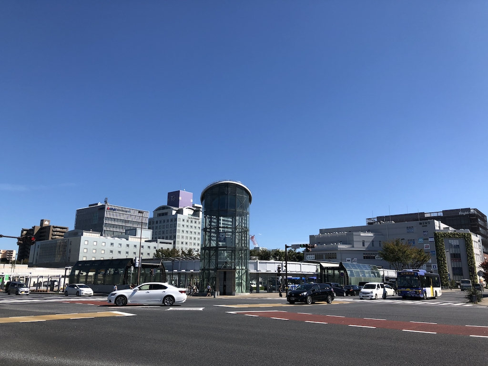
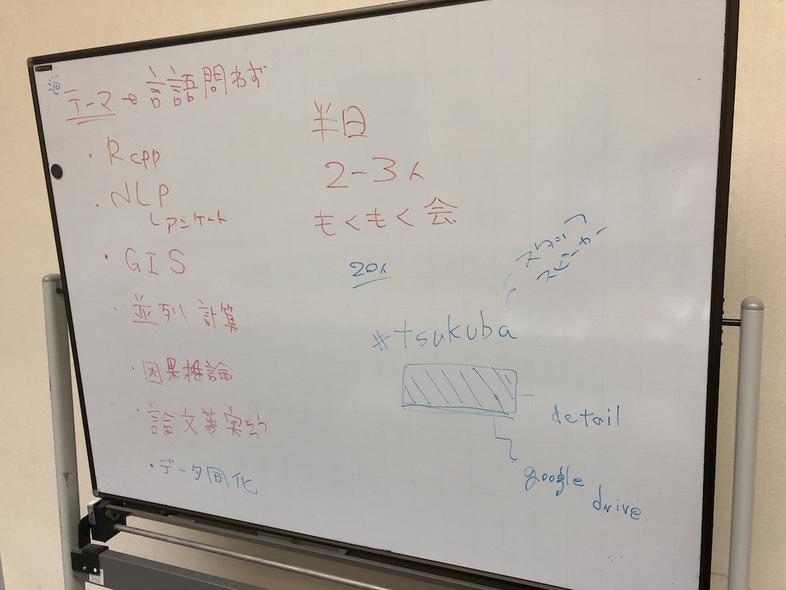

去る10月7日、およそ7年ぶりとなるTsukuba.Rが[つくばイノベーションプラザ](http://www.city.tsukuba.lg.jp/shisetsu/shiminseikatsu/1002800.html)にて[開催されました](https://www.meetup.com/ja-JP/TsukubaR/events/254321674/)[^1]。運営メンバーも刷新ということもあり、新生Tsukuba.Rとして再起動となります。イベントのナンバリングも#1と改めました。

[^1]: 前進となるTsukuba.Rの#9が2011年11月に開催されてから



立ち上げの回となった今回は、Tsukuba.Rのコミュニティとしてのあり方や今後の運営について議論する回でした。
ゲストスピーカーとして[\@kilometer00](http://twitter.com/kilometer00) さんにトークしていただり、LTや飛び込みでの発表があったりと賑わいました。

この記事では当日発表のあった資料と回の様子（主にTwitterからの実況）について報告します。話し合った内容についての詳細は[GitHub Issues](https://github.com/tsukubar/hq/issues)にまとめています。

```{r echo=FALSE}
blogdown::shortcode("tweet", "1048788392106807302")
```

```{r echo=FALSE}
blogdown::shortcode("tweet", "1048788304051621888")
```

記念すべき？最初のつぶやき。

## Guest Talk Sessoion \@kilometer00

国内のRコミュニティとして、もっとも規模が大きく歴史も長いTokyo.Rの運営メンバーを務めている[\@kilometer00](http://twitter.com/kilometer00)さん。話していただいたテーマは「初心者セッションを行う際のコンセプト」です。

<script async class="speakerdeck-embed" data-id="f6d07c06ab73475db39096901a2a15b6" data-ratio="1.33333333333333" src="//speakerdeck.com/assets/embed.js"></script>

[\@kilometer00](http://twitter.com/kilometer00)さんはここ数回のTokyo.Rの初心者セッションで毎回発表されています。行動神経科学を専門に研究されていることもあり、とてもわかりやすく、私自身もなるほど、と何度も納得してしまいました。

初めてRを触る、プログラミングをする人たちに対して、どのように考え方から伝えていく際の知見について学べました。

```{r echo=FALSE}
blogdown::shortcode("tweet", "1049186446077120513")
```

```{r echo=FALSE}
blogdown::shortcode("tweet", "1048872731054227457")
```


## Meeting session

一部抜粋です。

- Rコミュニティではあるけど、Rだけにこだわらず、「つくば」周辺の学生、研究者、データ分析に携わる人の交流の場、活動の支援を目指したい
    - 回のテーマは言語を問わずに。Python, Julia、なんでもこい。
- 一回の時間は数時間（平日）から半日（休日）。発表者は2,3人。時間が余ればもくもく会として自由時間に充てるのが良い。
- イベントページとして[meetup](https://www.meetup.com/ja-JP/TsukubaR/)を用意したが、日本人ユーザにはconnpassの方が馴染みがある。Tokyo.Rでの導入事例もあるので移行を検討する。
- meetup, Slack, [GitHub Organization](https://github.com/tsukubar)を通じてイベントの用意を行う
    - これらのサービスを利用しないメンバーには職場、メールを通して連絡



## Lighting Talk Session

話題提供として、[\niszet0](https://twitter.com/niszet0) さんのR Markdownでパワーポイントを作る、[\@u_ribo](https://twitter.com/u_ribo) による[textlint](http://textlint.github.io)の機能をRコード、R Markdownに導入する話がありました。また、予定にはなかったのですが、[\@hankagosa](https://twitter.com/hankagosa) さんが、統計モデリングの簡単な導入を行ってくださいました。（豪華な資料を超短時間で圧縮して説明するというもの！！）

### 超速ベイズ入門 \@hankagosa

```{r echo=FALSE}
blogdown::shortcode("tweet", "1048814910442893317")
```

```{r echo=FALSE}
blogdown::shortcode("tweet", "1048874643291951104")
```


### R Markdownでパワーポイント作成 \@niszet0

```{r echo=FALSE}
blogdown::shortcode("tweet", "1048824384008282113")
```

```{r echo=FALSE}
blogdown::shortcode("tweet", "1048874159898423296")
```

```{r echo=FALSE}
blogdown::shortcode("tweet", "1048827784766709760")
```

### textlintrパッケージ開発話 \@u_ribo

Twitter上のふとした一言で始まったtextlintのR移植パッケージtextlintrについて紹介しました。

https://github.com/uribo/textlintr

ぜひお試しください! バグ報告、機能追加のリクエストもお待ちしています。


## 祭りの後に...

不慣れな運営、進行でしたが、無事に開催できてひとまず安心です。参加された方、どうもありがとうございました。今後ともお世話になります。

Tsukuba.Rでは、運営をサポートしてくださるメンバーを募集しています。活動に興味のある方はぜひ、meetupでメンバー登録をおこなってください。TwitterやSlackで[\@tsukubar](https://twitter.com/tsukubar)または[\@u_ribo](https://twitter.com/u_ribo)あてにメンションを飛ばしていただいても構いません 😀

最後に、すべてではありませんがTwitter上で見かけたイベントの感想をピックアップします。

```{r echo=FALSE}
blogdown::shortcode("tweet", "1048858670778343425")
```

```{r echo=FALSE}
blogdown::shortcode("tweet", "1048881330627342339")
```

```{r echo=FALSE}
blogdown::shortcode("tweet", "1048871294266105856")
```

```{r echo=FALSE}
blogdown::shortcode("tweet", "1048880483164086274")
```
